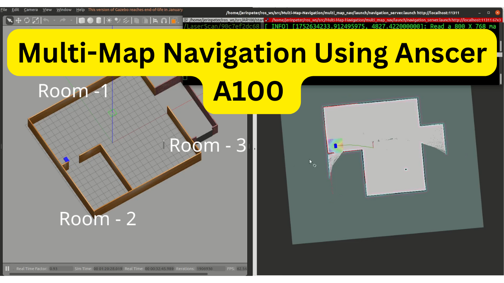
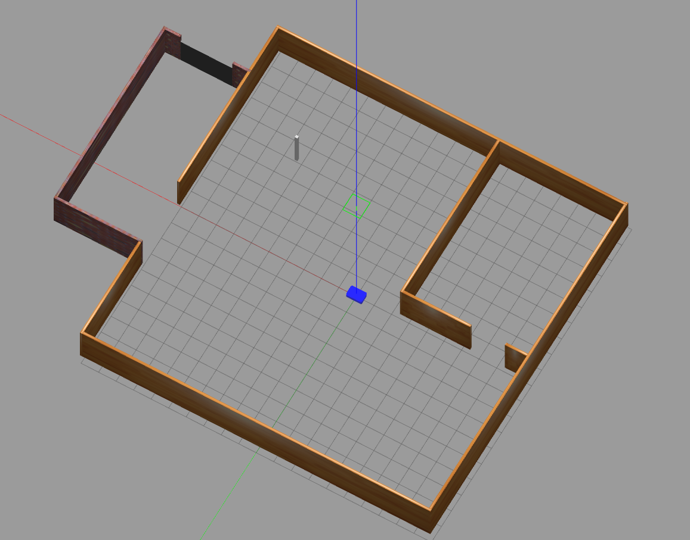
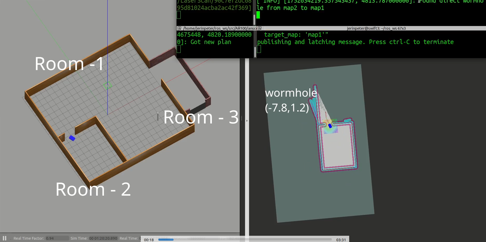
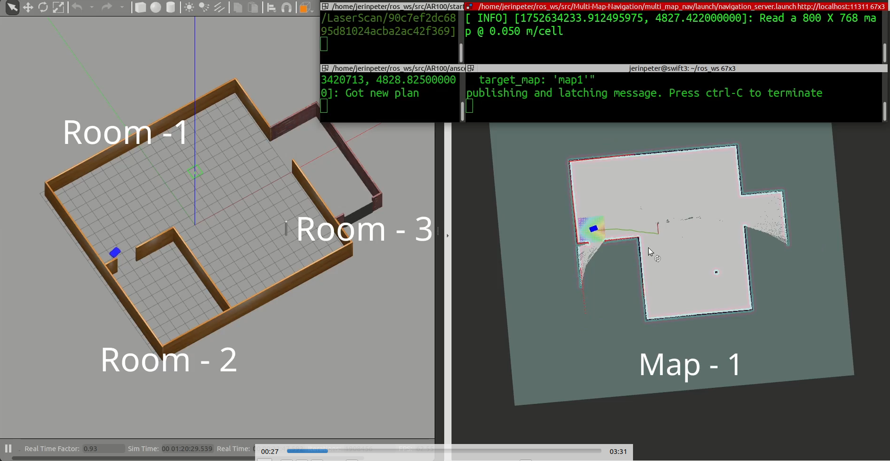
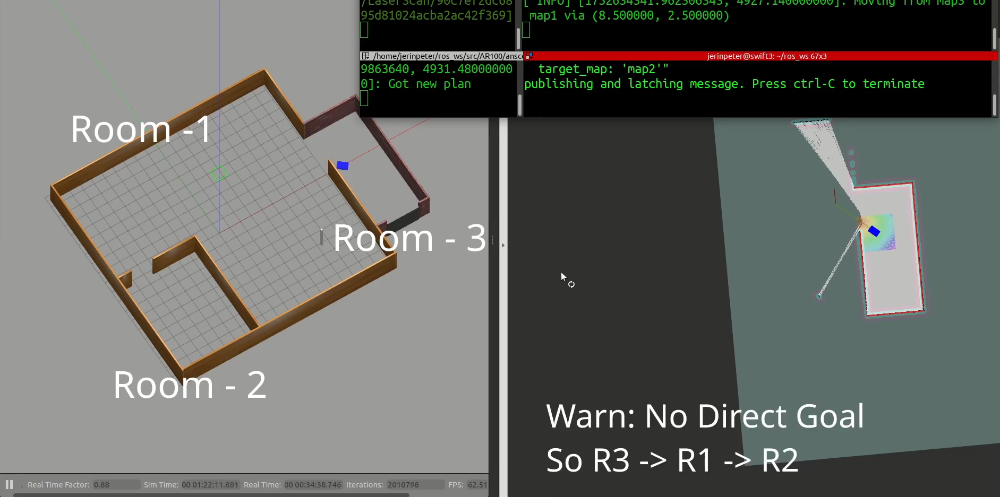
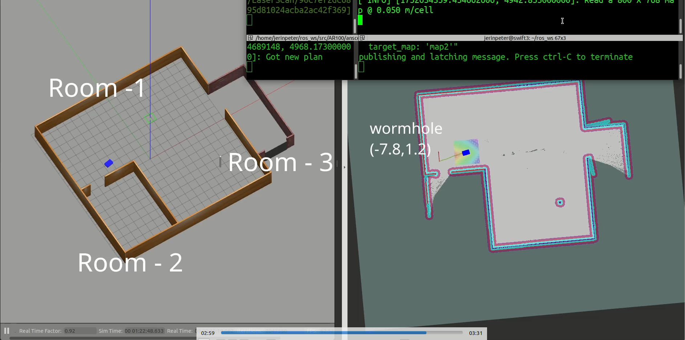
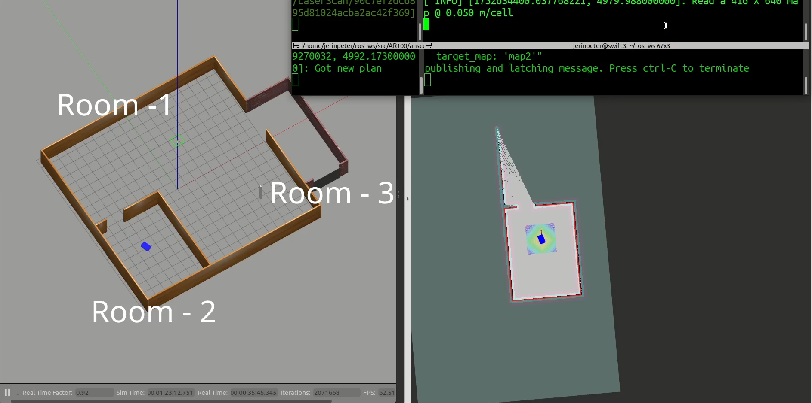

# Multi-Map Navigation Implementation using ANSCER A100 AMR

This repo shows the multi-map multi-room autonomous navigation implementation using wormholes for AR100 robot by Anscer robotics in a custom environment 

<p align="center">
  <a href="https://www.youtube.com/watch?v=18NSClquw_o" target="_blank">
    
  </a>
  <br/>
  <em>Click to view full video demo</em>
</p>
## Prerequisites

* [Ubuntu version : 20.04](https://ubuntu.com/download/desktop)
* [ROS version : Noetic](http://wiki.ros.org/noetic/Installation/Ubuntu)
* Editor used : [Vscode](https://code.visualstudio.com/download)
* Compiler  : catkin

## Building, Installation Setup & Usage
* Follow the the instructions [here](https://github.com/anscer/AR100) and install Anscer Robotics AR100 ROS package. 

* Replace the World folder with the one given in this repo (custom world with 3 room setup).

* Replace the map.pgm and map.yaml files in the map folder inside anscer_navigation folder with the map1.pgm and map1.yaml file in this repo and rename it to the default names.

* After this, you will have a working AR100 simulation for working with this repo.

<p align="center">
  
  <br/>
  <em>Simulation Setup</em>
</p>

#### 1. Clone the Package into Your Catkin Workspace:

```sh
cd ~/catkin_ws/src
git clone https://github.com/jerinpeter/ar100-multimap-nav.git

```

#### 2. Build the Workspace

```sh
cd ~/catkin_ws
catkin_make
source devel/setup.bash
```

#### 3. Launch the navigation server:

```
roslaunch multi_map_nav navigation_server.launch
```
Note: Your anscer_navigation should be up and running for this work 
#### 4. Send a navigation goal: You can send a goal using an action client, or use a custom script like:

You can send navigation goals using the ROS action client or directly with rostopic:

- Using `rostopic`:

  ```bash
  rostopic pub /navigate_to_goal/goal multi_map_nav/NavigateToGoalActionGoal "header:
    seq: 0
    stamp:
      secs: 0
      nsecs: 0
    frame_id: ''
  goal_id:
    stamp:
      secs: 0
      nsecs: 0
    id: ''
  goal:
    target_x: -5.0
    target_y: -6.0
    target_map: 'map2'"
  ```
## The Database Structure

The wormhole connections are stored in a SQLite database in the below format:

```sql
CREATE TABLE wormholes (
    from_map TEXT,  -- Source map name
    to_map TEXT,    -- Destination map name
    from_x REAL,    -- X-coordinate in source map
    from_y REAL     -- Y-coordinate in source map
);
```
## Custom Action Definition
NavigateToGoal.action:
```
# Request
float64 target_x
float64 target_y
string target_map

---

# Result
bool success
string message

---

# Feedback
string feedback_msg
```
## System Overview

### WormholeManager

- Connects to an SQLite database to retrieve wormhole data.
- Manages map-to-map connectivity and determines navigation routes.
- Supports querying direct and indirect transitions between maps.

### Wormhole Map Connections

| from_map | to_map | from_x | from_y |
|----------|--------|--------|--------|
| map1     | map2   | -7.8   | 1.2    |
| map2     | map1   | -7.8   | 1.0    |
| map1     | map3   |  8.5   | 2.5    |
| map3     | map1   |  8.5   | 2.5    |

### MapSwitcher

- Loads map configurations (YAML files) from a specified directory.
- Controls the `map_server` to switch between environments.
- Handles map transitions based on the robot’s planned route.

### NavigationServer

- Implements a ROS action server to process incoming navigation goals.
- Orchestrates the navigation process across maps.
- Integrates with `move_base` for path planning and execution within each individual map.

## Key Features

- Wormhole-based transitions between different maps.
- Lightweight SQLite database for storing and managing inter-map connections.
- Dynamic map switching using the standard ROS `map_server`.
- ROS-compatible action interface for receiving and handling navigation goals.
- Full integration with `move_base` for local navigation and obstacle avoidance.

## Navigation Workflow

### 1. Receiving a Navigation Goal

The system starts by accepting a navigation goal, which includes:
- The target coordinates (x, y)
- The name of the destination map

### 2. Evaluating the Current Map

Upon receiving the request, the system checks whether the destination is on the same map the robot is currently operating on:

- **If the target is within the current map**:  
  The goal is passed directly to `move_base` for standard ROS navigation.

- **If the target is in a different map**:  
  The system initiates multi-map path planning to determine the appropriate transition route.

### 3. Multi-Map Path Planning

Depending on the wormhole connectivity, the system selects either a direct or an indirect route:

#### Direct Map Transition
- A direct wormhole from the current map to the destination map is identified.
- The robot navigates to the wormhole location.
- The system loads the destination map.
- The robot proceeds to the final target location.

<p align="center">
  
  <br/>
  <em>Goal Given to Map1, Moving to Wormhole (map1<->map2)</em>
</p>

<p align="center">
  
  <br/>
  <em>Reached Wormhole, Activated Map2, Moving to goal</em>
</p>


#### Indirect Route via Central Hub (map 1)
- If no direct wormhole exists, the robot first transitions to a central hub map (e.g., `map1`).
- It then navigates to a wormhole leading to the destination map.
- Once the destination map is loaded, the robot moves to the target coordinates.

### 4. Segment-by-Segment Navigation

For each stage in the path:
- The robot receives a sub-goal corresponding to a wormhole or the final target.
- `move_base` handles local navigation.
- If the goal is reached, the next stage begins.
- If any step fails, the process is halted and an error is returned.


<p align="center">
  
  <br/>
  <em>No direct goal, Navigated back to Central hub</em>
</p>
<p align="center">
  
  <br/>
  <em>Room2 map gets activated and goal sets to Wormhole (R2<->R1)</em>
</p>
<p align="center">
  
  <br/>
  <em>Reached Goal</em>
</p>

---

This modular approach allows the robot to traverse complex, multi-room environments with minimal configuration, relying on a combination of wormhole-based transitions and traditional ROS navigation.


This architecture allows for scalable and modular multi-environment robot navigation, useful in applications such as smart buildings, warehouses, or research platforms.

## Further Work / Improvements

* Orientation of the robot is always set to `M_PI/2` which creates akward transistion between wormholes and the rooms.
* Can be solved by echoing current orientation and stopping at that, wait for map switch then continue navigation.
* Can add validity check for the waypoints, Even though the robot navigates to the correct room/map, I have not implemented a logic to check if the given coordinates are inside the map (not out of bounds).
* Can add Preemption handling,In the current implementation, if a goal is given another one can't be given until this is finished
