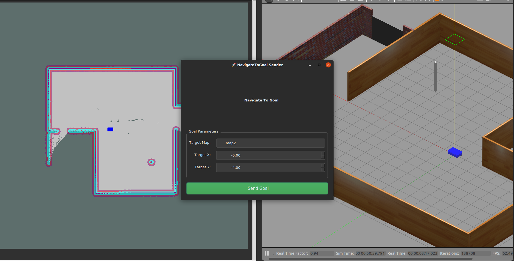

# 🧭 Multi-Map Navigation with ANSCER A100 AMR

This repository demonstrates **multi-map, multi-room autonomous navigation** using *wormhole-based transitions* on the **AR100 robot by Anscer Robotics**, tested in a custom multi-room environment.

<p align="center">
  <a href="https://www.youtube.com/watch?v=18NSClquw_o" target="_blank">
    
  </a>
  <br/>
  <em>🎥 Click to view full video demo</em>
</p>

## 🧰 Prerequisites
- **OS**: [Ubuntu 20.04](https://ubuntu.com/download/desktop)  
- **ROS**: [ROS Noetic](http://wiki.ros.org/noetic/Installation/Ubuntu)  
- **Editor**: [VSCode](https://code.visualstudio.com/download)  
- **Build System**: Catkin  

## ⚙️ Setup & Installation
1. **Install AR100 simulation**  
   Follow the instructions from the official [Anscer AR100 repository](https://github.com/anscer/AR100).

2. **Replace with Custom World**
   - Use the provided `World/` folder (3-room setup).
   - Replace `map.pgm` and `map.yaml` in `anscer_navigation/maps/` with `map1.pgm` and `map1.yaml` from this repo and rename them to the default names.

<p align="center">
  
  <br/>
  <em>Custom simulation setup</em>
</p>

## 🚀 How to Run

### 1. Clone this Repository
```bash
cd ~/catkin_ws/src
git clone https://github.com/jerinpeter/ar100-multimap-nav.git
```

### 2. Build the Package
```bash
cd ~/catkin_ws
catkin_make
source devel/setup.bash
```

### 3. Launch the Navigation Server
```bash
roslaunch multi_map_nav navigation_server.launch
```
> Note: Ensure `anscer_navigation` is running before launching the navigation server.

### 4. Send a Navigation Goal
You can publish a goal manually using `rostopic`:
```bash
rostopic pub /navigate_to_goal/goal multi_map_nav/NavigateToGoalActionGoal "header:
  seq: 0
  stamp: {secs: 0, nsecs: 0}
  frame_id: ''
goal_id:
  stamp: {secs: 0, nsecs: 0}
  id: ''
goal:
  target_x: -6.0
  target_y: -4.0
  target_map: 'map2'"
```
You can also publish a goal using the PyQT GUI

```bash
rosrun multi_map_nav LaunchUi.py
```
<p align="center">
  
  <br/><em>specify the map name as well as the target x and y coordinates</em>
</p>

## 🗃️ Database Structure
The **SQLite database** stores all wormhole connections:
```sql
CREATE TABLE wormholes (
  from_map TEXT,
  to_map   TEXT,
  from_x   REAL,
  from_y   REAL
);
```

### Sample Entries
| from_map | to_map | from_x | from_y |
|----------|--------|--------|--------|
| map1     | map2   | -7.8   | 1.2    |
| map2     | map1   | -7.8   | 1.0    |
| map1     | map3   |  8.5   | 2.5    |
| map3     | map1   |  8.5   | 2.5    |

## 🛠️ Custom Action Definition
**`NavigateToGoal.action`**
```action
# Goal
float64 target_x
float64 target_y
string target_map

---
# Result
bool success
string message

---
# Feedback
string feedback_msg
```

## 🔍 System Architecture

### 🧠 WormholeManager
- Connects to SQLite DB to retrieve wormhole data.
- Computes direct/indirect transitions between maps.
- Enables seamless planning across environments.

### 🗺️ MapSwitcher
- Loads `.pgm`/`.yaml` map files.
- Dynamically controls `map_server` for each transition.
- Resets localization when switching.

### 🚦 NavigationServer
- Custom ROS Action Server.
- Accepts goal with target (x, y) and map name.
- Decides if direct `move_base` call is enough or wormhole is needed.

## 🔄 Navigation Flow

### Step 1: Receive Goal
Receives:
- Coordinates (x, y)
- Target map name

### Step 2: Evaluate
- If goal is in current map → directly use `move_base`.
- Else → use wormhole path planning.

## 🌀 Transition Scenarios

### 🟢 Direct Transition
1. Go to wormhole in current map.
2. Switch map.
3. Continue to target.

<p align="center">
  
  <br/><em>Heading to wormhole (map2 → map1)</em>
</p>

<p align="center">
  
  <br/><em>Map1 activated, final goal reached</em>
</p>

### 🔁 Indirect via Hub (e.g. map1)
1. Navigate to hub.
2. Switch to next wormhole.
3. Go to final location.

<p align="center">
  
  <br/><em>Routing via map1 (hub)</em>
</p>

<p align="center">
  
  <br/><em>Map3 → map1 → map2 transition</em>
</p>

<p align="center">
  
  <br/><em>Final goal reached</em>
</p>

## ✨ Features
- 🛣️ Wormhole navigation across rooms/maps
- 💾 SQLite for persistent wormhole mapping
- 🔄 Dynamic map switching using `map_server`
- ⚙️ Full integration with `move_base`
- 🛰️ Actionlib interface for goal delivery
- 🧩 Modular architecture for scalability

## ⚠️ Limitations & Future Work

* Orientation of the robot is always set to `M_PI/2` which creates akward transistion between wormholes and the rooms.
* Can be solved by echoing current orientation and stopping at that, wait for map switch then continue navigation.
* Can add validity check for the waypoints, Even though the robot navigates to the correct room/map, I have not implemented a logic to check if the given coordinates are inside the map (not out of bounds).
* Can add Preemption handling, In the current implementation, if a goal is given another one can't be given until this is finished

## ✅ Assignment Checklist
| Requirement                              | Status |
|------------------------------------------|--------|
| 1. Video Demonstration                    | ✅ Yes |
| 2. C++ Source Code                        | ✅ Yes |
| 3a. Key files listed                      | ✅ Yes |
| 3b. Build & launch instructions           | ✅ Yes |
| 3c. Algorithm explained                   | ✅ Yes |
| 3d. Unimplemented parts mentioned         | ✅ Yes |

## 📦 Repository Summary
- `navigation_server.cpp` — Handles navigation requests & manages transitions  
- `map_switcher.cpp` — Switches map using `map_server`  
- `wormhole_manager.cpp` — Loads DB & determines routes  
- `launch/` — Startup configurations  
- `media/` — Simulation images  
- `README.md` — You’re reading it!

This project provides a **modular and scalable framework** for **multi-environment navigation** using ROS and SQLite, ideal for smart facilities, research robots, or warehouse AMRs.
